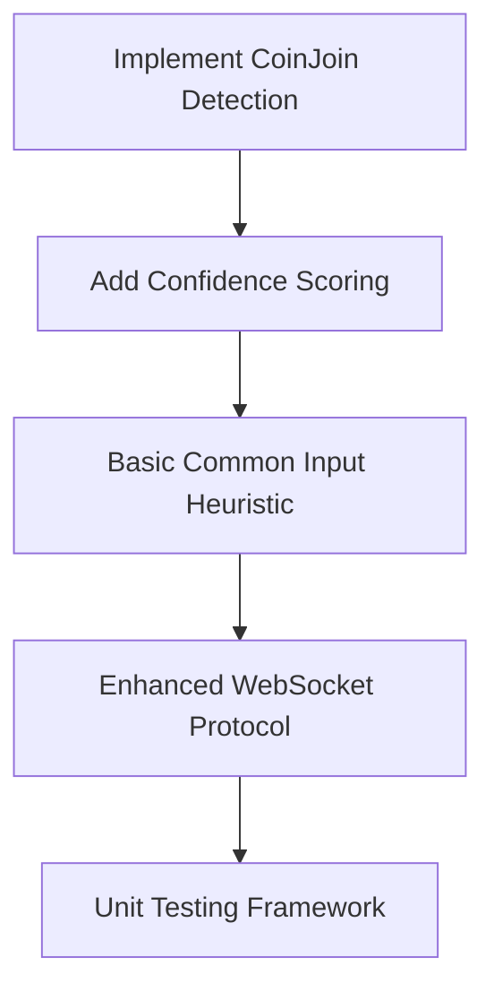
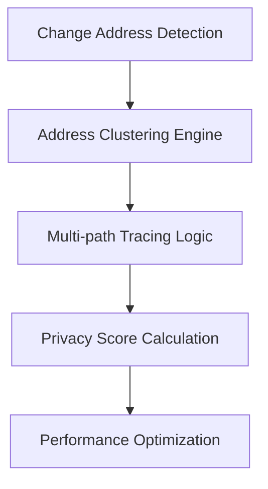
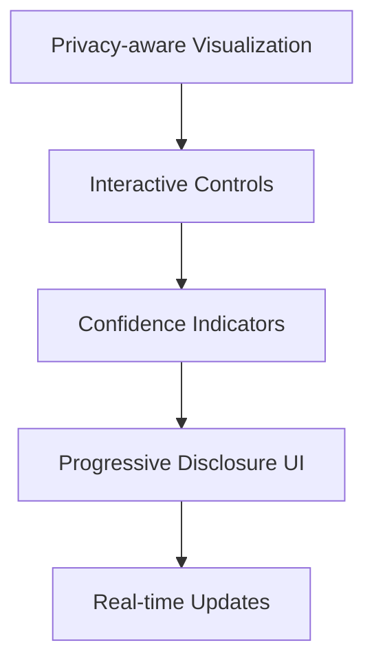

# Bitcoin Satoshi Tracer - Next Steps for CoinJoin Handling and Address Heuristics Improvements

## Executive Summary

The current Bitcoin Satoshi Tracer implementation has significant limitations in handling privacy-enhanced transactions (CoinJoins) and applying sophisticated address clustering heuristics. This document outlines comprehensive improvements to transform the tool from a simple transaction follower into a sophisticated blockchain forensics platform while respecting privacy boundaries.

## Current Implementation Analysis

### Existing Limitations

The current [`get_utxo_history()`](backend/bitcoin_rpc.py:11) function exhibits several critical shortcomings:

1. **No CoinJoin Detection**: Treats all transactions equally without recognizing mixing patterns
2. **No Address Clustering**: Missing common ownership heuristics
3. **Linear Tracing Only**: Doesn't handle branching paths or uncertainty in mixed transactions
4. **No Privacy Scoring**: No indication of transaction privacy levels or tracing confidence
5. **Limited Transaction Analysis**: Basic RPC data retrieval without advanced pattern recognition

### Current Code Structure
```python
def get_utxo_history(txid, vout):
    # Overly simplistic implementation:
    # - No mixing detection
    # - No confidence scoring
    # - No address clustering
    # - Simple stack-based traversal
```

## Comprehensive Improvement Plan

### 1. CoinJoin Detection & Analysis

#### 1.1 Detection Algorithms

**Equal Output CoinJoins** (Wasabi, JoinMarket):
- Pattern: N inputs → M equal outputs + change outputs
- Detection metric: Count outputs with identical values
- Entropy calculation: `log2(number_of_equal_outputs!) / total_outputs`

**Whirlpool Pattern** (Samourai):
- Fixed denomination pools (0.001, 0.01, 0.05, 0.1 BTC)
- Exactly 5 participants per mix
- Pattern: 5 inputs → 5 equal outputs

**PayJoin/P2EP**:
- 2 inputs, 2 outputs pattern
- Breaks common input ownership heuristic
- Harder to detect (appears as regular payment)

#### 1.2 Implementation Structure
```python
class CoinJoinDetector:
    def detect_coinjoin(self, transaction):
        signals = {
            'equal_outputs': self._analyze_equal_outputs(tx),
            'io_ratio': self._analyze_io_ratio(tx),
            'round_amounts': self._detect_round_amounts(tx),
            'fee_patterns': self._analyze_fee_patterns(tx),
            'timing': self._analyze_timing_patterns(tx)
        }
        return self._calculate_coinjoin_probability(signals)
```

#### 1.3 Detection Signals
- **Equal Output Count**: Multiple outputs with identical values
- **Input/Output Ratio**: Unusual number of inputs vs outputs
- **Round Number Detection**: Coordinated round payment amounts
- **Fee Pattern Analysis**: Equal fees suggesting coordination
- **Temporal Clustering**: Participants joining simultaneously

### 2. Enhanced Address Heuristics

#### 2.1 Common Input Ownership Heuristic (CIOH)
**Principle**: All inputs to a transaction likely controlled by same entity (except CoinJoins)
```python
def apply_common_input_heuristic(transaction):
    input_addresses = []
    for vin in transaction['vin']:
        prev_tx = get_transaction(vin['txid'])
        addr = prev_tx['vout'][vin['vout']]['scriptPubKey'].get('addresses', [])
        input_addresses.extend(addr)
    return cluster_addresses(input_addresses)
```

#### 2.2 Change Address Detection
**Signals for Change Detection**:
- Non-round amounts (1.23456789 BTC vs 1.0 BTC)
- Address type consistency with inputs
- Output position patterns
- Value patterns (change = inputs - payment - fees)

```python
def detect_change_addresses(tx):
    for i, output in enumerate(tx['vout']):
        signals = {
            'non_round_amount': is_non_round_amount(output['value']),
            'address_type_consistency': check_address_type_consistency(output, inputs),
            'position_pattern': analyze_output_position(i, len(outputs)),
            'value_analysis': analyze_change_value_patterns(output, tx)
        }
        change_score = weighted_sum(signals)
```

#### 2.3 Address Clustering Methods
- **Script Type Clustering**: Group by P2PKH, P2SH, Bech32 patterns
- **Reuse Pattern Analysis**: Track addresses used multiple times
- **Temporal Analysis**: Group transactions by timing patterns
- **Fee Pattern Clustering**: Use fee calculation patterns for ownership

### 3. Privacy-Aware Tracing System

#### 3.1 Multi-Path Tracing
```python
class PrivacyAwareTracer:
    def trace_utxo_with_privacy_analysis(self, txid, vout):
        # Priority queue with confidence scoring
        queue = [(-1.0, txid, vout, [])]  # (neg_confidence, txid, vout, path)
        
        while queue:
            confidence, current_txid, current_vout, path = heappop(queue)
            
            if is_coinjoin(current_tx):
                # Multiple possible paths with lower confidence
                possible_paths = analyze_coinjoin_paths(tx, current_vout)
                for path_confidence, prev_txid, prev_vout in possible_paths:
                    new_confidence = confidence * path_confidence
                    heappush(queue, (-new_confidence, prev_txid, prev_vout, updated_path))
```

#### 3.2 Confidence Scoring System
- **Base Confidence**: 1.0 for regular transactions, variable for CoinJoins
- **Heuristic Multipliers**: Apply confidence reduction based on uncertainty
- **Path Probability**: Calculate likelihood of specific trace paths through mixers
- **Circuit Breaker**: Stop tracing when confidence drops below threshold

#### 3.3 Privacy Scoring Framework
```python
def calculate_privacy_score(transaction):
    factors = {
        'is_coinjoin': detect_coinjoin(tx),
        'equal_outputs': count_equal_outputs(tx),
        'input_diversity': measure_input_diversity(tx),
        'address_reuse': check_address_reuse(tx),
        'timing_correlation': analyze_timing_patterns(tx)
    }
    return weighted_privacy_calculation(factors)
```

### 4. Advanced Transaction Analysis

#### 4.1 Temporal Pattern Analysis
- **Burst Detection**: Users often make transactions in clusters
- **Periodic Patterns**: Regular payment schedules
- **Mempool Timing**: CoinJoin coordination timing

#### 4.2 Value Pattern Analysis
- **Round Number Detection**: Distinguish payments (1.0 BTC) from change (0.87654321 BTC)
- **Dust Analysis**: Identify dust attacks and consolidation patterns
- **Fee Analysis**: Wallet-specific fee calculation methods

#### 4.3 UTXO Set Analysis
- **Coin Age Patterns**: Track UTXO age and spending patterns
- **Consolidation Detection**: Identify wallet maintenance activities
- **Split Pattern Analysis**: Detect transaction splitting behaviors

## Implementation Roadmap

### Phase 1: Foundation (2-3 weeks)


**Deliverables**:
- CoinJoin detection with 90%+ accuracy
- Confidence scoring system
- Basic address clustering
- Enhanced WebSocket data structure
- Comprehensive test suite

### Phase 2: Advanced Analytics (3-4 weeks)


**Deliverables**:
- Complete address clustering engine
- Multi-path tracing through CoinJoins
- Privacy-aware confidence calculations
- Caching and performance optimizations
- Advanced heuristics implementation

### Phase 3: UI Enhancement (2-3 weeks)


**Deliverables**:
- Enhanced D3.js visualizations
- Privacy indicator system
- Interactive trace controls
- Uncertainty visualization
- Real-time confidence updates

## Technical Specifications

### Backend Architecture Changes

#### Enhanced Bitcoin RPC Client
```python
class EnhancedBitcoinTracer:
    def __init__(self):
        self.rpc = AuthServiceProxy(rpc_connection_string)
        self.privacy_tracer = PrivacyAwareTracer()
        self.coinjoin_detector = CoinJoinDetector()
        self.clustering_engine = AddressClusteringEngine()
        self.cache = TransactionCache()
    
    def get_enhanced_utxo_history(self, txid, vout):
        """Drop-in replacement with privacy analysis"""
        trace_result = self.privacy_tracer.trace_utxo_with_privacy_analysis(txid, vout)
        
        for node in trace_result['nodes']:
            yield {
                'txid': node['txid'],
                'vout': node['vout'],
                'addresses': node.get('addresses', []),
                'confidence': node['confidence'],
                'privacy_score': node['privacy_analysis']['privacy_score'],
                'is_coinjoin': node['privacy_analysis']['is_coinjoin'],
                'mixer_type': node['privacy_analysis'].get('mixer_type'),
                'cluster_id': node.get('cluster_id'),
                'heuristics_applied': node.get('heuristics', [])
            }
```

#### WebSocket Protocol Enhancement
```python
# Enhanced WebSocket messages
{
    "type": "trace_update",
    "data": {
        "txid": "abc123...",
        "vout": 0,
        "addresses": ["1A1zP1eP5QGefi2DMPTfTL5SLmv7DivfNa"],
        "confidence": 0.85,
        "privacy_analysis": {
            "privacy_score": 0.7,
            "is_coinjoin": true,
            "mixer_type": "whirlpool",
            "coinjoin_participants": 5
        },
        "clustering_info": {
            "cluster_id": "cluster_001",
            "cluster_confidence": 0.9,
            "heuristics_applied": ["common_input", "change_detection"]
        },
        "trace_metadata": {
            "depth": 3,
            "branch_factor": 2,
            "alternative_paths": 3
        }
    }
}
```

### Frontend Architecture Changes

#### Enhanced React Components
```javascript
// Privacy-aware tree visualization
const PrivacyAwareTreeGraph = ({ data }) => {
    const privacyColorScale = d3.scaleLinear()
        .domain([0, 0.5, 1])
        .range(['#ff4444', '#ffaa00', '#44ff44']);
    
    const confidenceScale = d3.scaleLinear()
        .domain([0, 1])
        .range([5, 15]);
    
    // Enhanced node rendering with privacy indicators
    const nodes = svg.selectAll('.node')
        .data(data.nodes)
        .enter()
        .append('g')
        .attr('class', 'node');
    
    // Main node with privacy color coding
    nodes.append('circle')
        .attr('r', d => confidenceScale(d.confidence))
        .attr('fill', d => privacyColorScale(d.privacy_score))
        .attr('stroke', d => d.is_coinjoin ? '#ff00ff' : '#000000')
        .attr('stroke-width', d => d.is_coinjoin ? 3 : 1);
};
```

#### Interactive Control Panel
```javascript
const TraceControlPanel = ({ onSettingsChange }) => (
    <div className="trace-controls">
        <div className="control-group">
            <label>Confidence Threshold</label>
            <input type="range" min="0" max="1" step="0.1" 
                   onChange={e => onSettingsChange({confidence_threshold: e.target.value})} />
        </div>
        
        <div className="control-group">
            <label>Privacy Analysis Mode</label>
            <select onChange={e => onSettingsChange({privacy_mode: e.target.value})}>
                <option value="full">Full Analysis</option>
                <option value="respectful">Privacy-Respectful</option>
                <option value="minimal">Minimal Intrusion</option>
            </select>
        </div>
        
        <div className="control-group">
            <input type="checkbox" id="show_uncertain" 
                   onChange={e => onSettingsChange({show_uncertain_paths: e.target.checked})} />
            <label htmlFor="show_uncertain">Show Uncertain Paths</label>
        </div>
    </div>
);
```

## Resource Requirements

### Dependencies
```python
# Additional backend requirements
networkx==3.1           # Graph analysis algorithms
scikit-learn==1.3.0     # Clustering and ML algorithms
numpy==1.24.3           # Numerical computations
redis==4.6.0            # Caching layer
scipy==1.10.1           # Statistical analysis
```

```javascript
// Additional frontend requirements
"d3": "^7.8.0",                    // Enhanced visualizations
"react-spring": "^9.7.0",         // Smooth animations
"react-window": "^1.8.8",         // Virtual scrolling for large datasets
"lodash": "^4.17.21"               // Utility functions
```

### Infrastructure Requirements
- **Memory**: 2-4x increase (500MB → 1-2GB) due to caching and graph structures
- **CPU**: 3-5x increase for complex heuristic calculations
- **Network**: 2-3x more RPC calls for enhanced analysis
- **Storage**: Optional 10-50GB for transaction cache (recommended for performance)

### Performance Benchmarks
- **Current**: ~1000 transactions per trace, ~2 seconds response time
- **Enhanced**: ~500 transactions per trace, ~5-10 seconds response time
- **Optimized**: With caching, maintain ~800 transactions, ~3-5 seconds response time

## Risk Assessment and Mitigation

### High-Risk Areas

#### 1. Performance Degradation
**Risk**: Complex analysis may cause timeouts on large transaction traces
**Mitigation**:
- Implement depth limits (default: 50 transactions)
- Add confidence thresholds (stop at <10% confidence)
- Use background processing for expensive calculations
- Implement progressive loading for UI

#### 2. False Positive CoinJoin Detection
**Risk**: Misidentifying legitimate transactions as privacy-enhanced
**Mitigation**:
- Require multiple positive signals for CoinJoin classification
- Implement confidence intervals for all detection
- Add manual override capabilities
- Continuous testing against known transaction sets

#### 3. Privacy and Surveillance Concerns
**Risk**: Enhanced tool could enable unwanted surveillance activities
**Mitigation**:
- Include privacy impact warnings in UI
- Implement "privacy-respectful" mode
- Clear documentation of limitations and intended use
- Ethical guidelines for usage

### Medium-Risk Areas

#### 4. Code Complexity and Maintenance
**Risk**: Sophisticated algorithms increase maintenance burden
**Mitigation**:
- Comprehensive unit testing (>90% coverage)
- Modular architecture for independent component updates
- Detailed technical documentation
- Gradual rollout with feature flags

#### 5. User Experience Complexity
**Risk**: Advanced features may confuse users
**Mitigation**:
- Progressive disclosure interface design
- Default to simple mode with advanced options hidden
- Interactive tutorials and documentation
- User feedback collection and iteration

### Low-Risk Areas

#### 6. Backward Compatibility
**Risk**: Enhanced features break existing functionality
**Mitigation**:
- Maintain original API interface
- Enhanced features as optional extensions
- Comprehensive regression testing

## Success Metrics and KPIs

### Technical Performance Metrics
- **CoinJoin Detection Accuracy**: >90% precision, >85% recall
- **Address Clustering Accuracy**: >80% precision for known clusters
- **Tracing Confidence**: Mean confidence >70% for non-mixed transactions
- **Performance Impact**: <5x slowdown compared to current implementation
- **False Positive Rate**: <10% for all detection algorithms

### User Experience Metrics
- **Feature Adoption**: >50% of users enable advanced features
- **Visualization Clarity**: Users distinguish mixed vs regular transactions >90% of the time
- **Error Rate**: <5% user-reported analysis errors
- **User Satisfaction**: >4/5 rating for enhanced features

### System Reliability Metrics
- **Uptime**: >99.5% availability
- **Error Handling**: <1% unhandled exceptions
- **Cache Hit Rate**: >80% for frequently accessed transactions
- **Memory Usage**: <2GB peak usage under normal load

## Ethical Considerations and Guidelines

### Privacy Principles
1. **Transparency**: Clear indication when privacy features are detected
2. **Proportionality**: Analysis depth should match investigation needs
3. **User Control**: Provide options to limit analysis intrusiveness
4. **Documentation**: Clear explanations of detection methods and limitations

### Recommended Usage Guidelines
- **Legitimate Investigations**: Focus on compliance and fraud detection
- **Educational Purposes**: Blockchain analysis research and learning
- **Privacy Research**: Understanding effectiveness of privacy tools
- **Avoid**: Stalking, harassment, or unauthorized surveillance

### Technical Safeguards
- Privacy impact warnings for intensive analysis
- Confidence uncertainty clearly displayed
- Alternative path visualization for ambiguous traces
- Logging and audit trails for analysis activities

## Testing Strategy

### Unit Testing Framework
```python
# Comprehensive test coverage
class TestCoinJoinDetection(unittest.TestCase):
    def test_wasabi_detection(self):
        # Test known Wasabi CoinJoin patterns
        
    def test_whirlpool_detection(self):
        # Test Samourai Whirlpool patterns
        
    def test_false_positive_prevention(self):
        # Test legitimate transactions don't trigger detection
        
    def test_confidence_scoring(self):
        # Test confidence calculations are consistent
```

### Integration Testing
- End-to-end trace accuracy testing
- Performance testing under various loads
- WebSocket communication reliability
- UI responsiveness with large datasets

### User Acceptance Testing
- Usability testing for new features
- Accuracy validation by domain experts
- Performance testing on real-world traces
- Privacy feature effectiveness evaluation

## Deployment Strategy

### Gradual Rollout Plan
1. **Alpha Release**: Core team testing with limited feature set
2. **Beta Release**: Extended team with basic CoinJoin detection
3. **Release Candidate**: Full feature set with selected users
4. **Production Release**: General availability with monitoring

### Feature Flag Implementation
```python
class FeatureFlags:
    ENHANCED_COINJOIN_DETECTION = True
    ADVANCED_CLUSTERING = False  # Gradual rollout
    MULTI_PATH_TRACING = False   # Beta testing
    PRIVACY_RESPECTFUL_MODE = True
```

### Monitoring and Alerting
- Performance monitoring for response times
- Error rate monitoring for new algorithms
- Resource usage tracking
- User experience metrics collection

## Future Enhancements (Post-MVP)

### Advanced Features
1. **Machine Learning Integration**: Train models on known transaction patterns
2. **Cross-Chain Analysis**: Extend to other UTXO-based cryptocurrencies
3. **Real-time Monitoring**: Stream analysis of incoming transactions
4. **API Integration**: Connect with blockchain analysis services
5. **Export Capabilities**: Generate reports for compliance purposes

### Research Areas
1. **Lightning Network Integration**: Analyze on-chain/off-chain interaction
2. **DeFi Protocol Analysis**: Understand decentralized finance patterns
3. **Privacy Coin Analysis**: Extend methods to Zcash, Monero analysis
4. **Regulatory Compliance**: Automated compliance checking features

## Conclusion

The proposed enhancements will transform the Bitcoin Satoshi Tracer from a simple transaction follower into a sophisticated, privacy-aware blockchain analysis platform. The implementation plan balances technical sophistication with usability, performance with accuracy, and capability with ethical considerations.

Key success factors:
- **Modular Implementation**: Allows gradual feature rollout and testing
- **Privacy Awareness**: Respects user privacy while enabling legitimate analysis  
- **Performance Optimization**: Maintains usability despite increased complexity
- **User Experience**: Progressive disclosure keeps interface approachable
- **Ethical Framework**: Guidelines ensure responsible usage

The enhanced Bitcoin Satoshi Tracer will serve as a valuable tool for blockchain researchers, compliance professionals, and security analysts while maintaining respect for the privacy/transparency balance inherent in Bitcoin's design.

---

## Getting Started

To begin implementation:

1. **Set up development environment** with enhanced dependencies
2. **Start with Phase 1** - CoinJoin detection and confidence scoring  
3. **Implement comprehensive testing** from the beginning
4. **Use feature flags** for gradual rollout
5. **Monitor performance** throughout development

For questions or clarification on any aspect of this implementation plan, refer to the detailed technical specifications and code examples provided throughout this document.